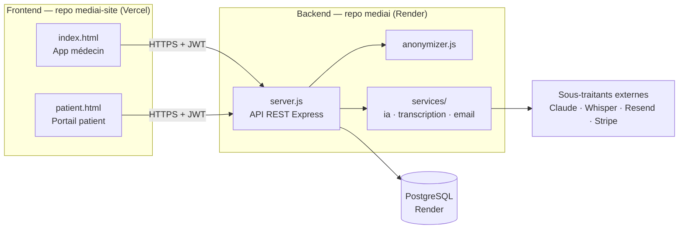

# 00 — START HERE

> **Point d'entrée unique de MediAI.** Si vous êtes un nouveau développeur (humain ou IA), lisez ce fichier en premier. En 10 minutes vous saurez ce qu'est MediAI, comment le code est organisé, et où trouver le reste.

---

## Qu'est-ce que MediAI ?

MediAI est un **SaaS médical français** pour les professionnels de santé. Il transforme une consultation dictée en **compte-rendu structuré** grâce à l'IA, gère les dossiers patients, génère les documents médicaux (ordonnances, courriers) et offre un **portail patient** séparé.

Ambition : devenir *le logiciel médical le plus agréable à utiliser en France* — « le plus agréable, pas le plus complet ».

→ Détails : [01_VISION.md](01_VISION.md) et [02_PRODUCT.md](02_PRODUCT.md).

---

## Architecture en une image



- **Backend** : Node/Express monolithique (`server.js`), PostgreSQL, déployé sur **Render** (auto-deploy depuis `main`).
- **Frontend** : deux fichiers HTML autonomes dans un **repo séparé `mediai-site`**, déployés sur **Vercel**.
- **IA** : Claude (comptes-rendus) + Whisper (transcription), isolés dans `services/` pour la portabilité.

→ Détails : [06_ARCHITECTURE.md](06_ARCHITECTURE.md).

---

## Structure des dépôts

Deux dépôts Git distincts :

| Dépôt | Contenu | Déploiement |
|---|---|---|
| `mediai` (celui-ci) | Backend (`server.js`, `db.js`, `anonymizer.js`, `prompts.js`, `services/`), documentation (`docs/`) | Render |
| `mediai-site` | `index.html` (médecin), `patient.html` (patient) | Vercel |

```
mediai/
├── server.js          API REST (Express) — tous les endpoints
├── db.js              Accès PostgreSQL (requêtes + schéma)
├── anonymizer.js      Dé-identification avant envoi à l'IA
├── prompts.js         Prompts système/utilisateur de chaque fonction IA
├── services/          Sous-traitants isolés (portabilité HDS)
│   ├── ia.js          Appel Claude (callClaude)
│   ├── transcription.js  Appel Whisper
│   └── email.js       Appel Resend
├── docker/Dockerfile  Image de conteneur (migration HDS — voir 10_SECURITY)
├── test/              Tests (node:test)
├── .env.example       Surface de configuration complète
└── docs/              ← LA source de vérité (vous êtes ici)
```

---

## Démarrer en local

```bash
cp .env.example .env      # puis remplir au minimum DATABASE_URL + ANTHROPIC_API_KEY
npm install
npm start                 # démarre server.js sur le PORT (défaut 3001)
npm test                  # lance la base de tests (node:test)
```

Le frontend n'a pas de build : ouvrir `mediai-site/index.html` directement, ou le servir statiquement. Il pointe vers le backend de production via la constante `API_BASE`.

---

## Règle d'or absolue (conformité)

> **Tant que l'infrastructure n'est pas hébergée HDS, AUCUNE vraie donnée patient.** Données **synthétiques uniquement**.

L'infra actuelle (Render US + Claude/Whisper US) n'est pas certifiée Hébergeur de Données de Santé. → [10_SECURITY.md](10_SECURITY.md) et la préparation migration dans la même section.

---

## Carte de la documentation

| Fichier | À lire si vous voulez… |
|---|---|
| [01_VISION.md](01_VISION.md) | comprendre *pourquoi* MediAI existe |
| [02_PRODUCT.md](02_PRODUCT.md) | savoir ce que fait le produit et ce qui le différencie |
| [03_PROJECT_STATE.md](03_PROJECT_STATE.md) | l'état **actuel** : ce qui est fait, en cours, à venir |
| [04_DESIGN_SYSTEM.md](04_DESIGN_SYSTEM.md) | coder une UI conforme (couleurs, typo, composants…) |
| [05_UX_PRINCIPLES.md](05_UX_PRINCIPLES.md) | les principes d'expérience à respecter |
| [06_ARCHITECTURE.md](06_ARCHITECTURE.md) | comment le système est construit (+ diagrammes) |
| [07_DATABASE.md](07_DATABASE.md) | le schéma de données |
| [08_AI_SYSTEM.md](08_AI_SYSTEM.md) | comment fonctionne l'IA (prompts, anonymisation) |
| [09_PATIENT_SYSTEM.md](09_PATIENT_SYSTEM.md) | le portail patient et son cloisonnement |
| [10_SECURITY.md](10_SECURITY.md) | sécurité, conformité RGPD/HDS, migration |
| [11_ROADMAP.md](11_ROADMAP.md) | la trajectoire produit |
| [12_CODE_GUIDELINES.md](12_CODE_GUIDELINES.md) | comment écrire du code ici |
| [13_COMPONENTS.md](13_COMPONENTS.md) | l'inventaire des composants UI |
| [14_BACKLOG.md](14_BACKLOG.md) | la dette technique et les idées |
| [CHANGELOG.md](CHANGELOG.md) | l'historique des changements notables |

**Cette documentation est la source de vérité.** Si le code et la doc divergent, c'est un bug : corrigez l'un ou l'autre, ne laissez jamais l'écart.
