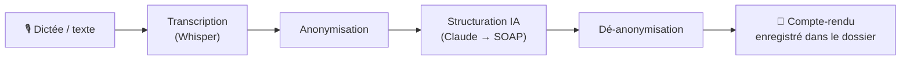

# 02 — PRODUCT

Spécification produit de MediAI. Décrit **ce que fait** le produit et **ce qui le différencie**. Pour l'état d'avancement (fait / en cours / à venir), voir [03_PROJECT_STATE.md](03_PROJECT_STATE.md).

---

## Présentation

MediAI est une plateforme SaaS destinée aux professionnels de santé. Elle centralise l'activité du cabinet : dossiers patients, comptes-rendus, documents médicaux, et un portail patient.

**Cœur du produit — le pipeline de consultation :**

---

## Fonctionnalités (par domaine)

### Authentification & comptes
- Médecin : email + mot de passe, ou **Google Sign-In**.
- Profil professionnel : nom, RPPS, cabinet, téléphone, spécialité, présentation.
- Préférences : spécialité par défaut, instructions IA personnalisées.
- Patient : portail séparé, accès activé **dossier par dossier** par le médecin.

### Gestion des patients
- Création, recherche, fiche patient avec synthèse dérivée du dossier.
- **Timeline** d'événements médicaux (chronologie filtrable).

### Consultation & documents
Chaque événement médical est typé et rattaché au patient :
- **Compte-rendu** (SOAP) généré depuis la transcription.
- **Ordonnance** (prescriptions structurées).
- **Courrier** de correspondance (généré depuis une consultation).
- **Analyses de laboratoire** et **imagerie** structurées (extraction, pas d'interprétation).

### Assistant IA (aide, jamais décision)
- Résumé intelligent du dossier · préparation de consultation · recherche sémantique dans le dossier.
- Questions d'interrogatoire suggérées · vérification d'interactions médicamenteuses.

→ Détail des règles IA : [08_AI_SYSTEM.md](08_AI_SYSTEM.md).

### Portail patient
Le patient consulte (jamais ne modifie) : ses documents, comptes-rendus, ordonnances, sa chronologie. → [09_PATIENT_SYSTEM.md](09_PATIENT_SYSTEM.md).

### Business
- Abonnement **Pro** via Stripe (webhook = source de vérité).
- **Quota gratuit** : 3 actions IA / mois, remise à zéro mensuelle.

---

## Ce qui différencie MediAI

1. **Le scribe IA** — dictée → compte-rendu SOAP structuré automatiquement. Le gain de temps concret qui justifie tout le reste. *La* killer feature.
2. **L'intelligence du dossier** — résumé narratif, préparation de consultation, recherche sémantique : « comprendre un patient en 5 secondes ».
3. **La finition premium** — niveau Linear/Notion/Stripe dans un secteur au design fonctionnel-mais-laid.
4. **Souveraineté & confiance** — anonymisation transparente + trajectoire d'hébergement HDS France.
5. **Continuité médecin ↔ patient** — un portail patient élégant *intégré*, pas un produit à part.
6. **« Moins mais mieux »** — le plus agréable, pas le plus complet.

---

## Non-objectifs (pour l'instant)

- Pas un outil de **décision** clinique : l'IA structure et assiste, elle ne diagnostique pas.
- Pas d'analyse d'image médicale (imagerie = structuration de texte déjà rédigé).
- Pas de prise de rendez-vous / téléconsultation (hors périmètre actuel).

---

## Public cible

Médecins généralistes et spécialistes en cabinet, kinésithérapeutes, à terme tout professionnel de santé libéral français cherchant à réduire la charge administrative sans changer sa pratique.
