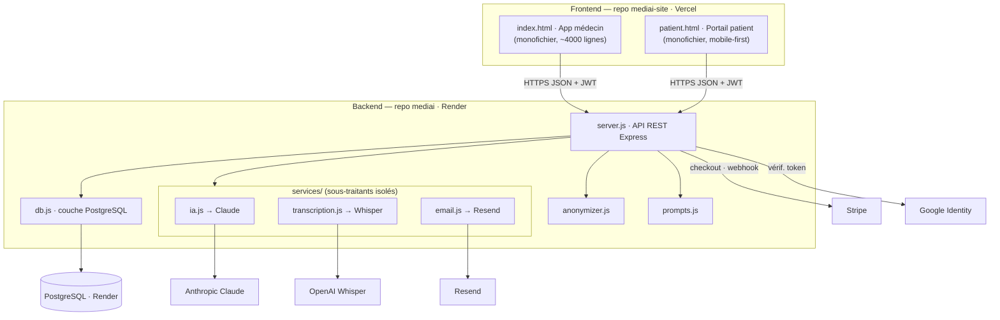
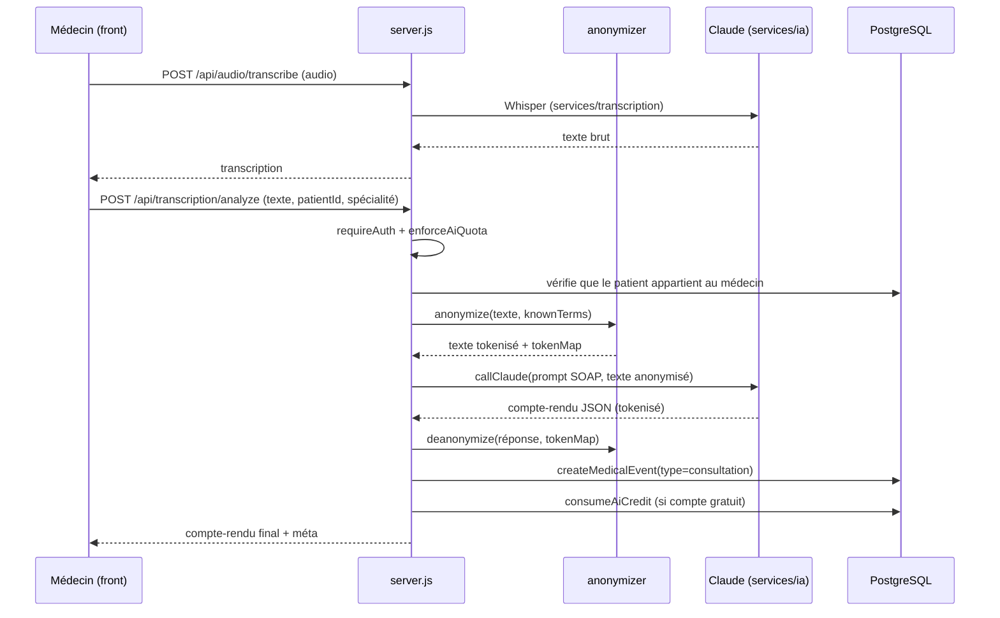
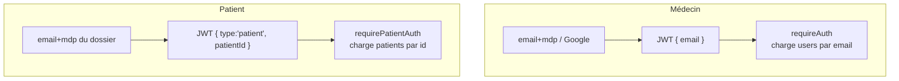
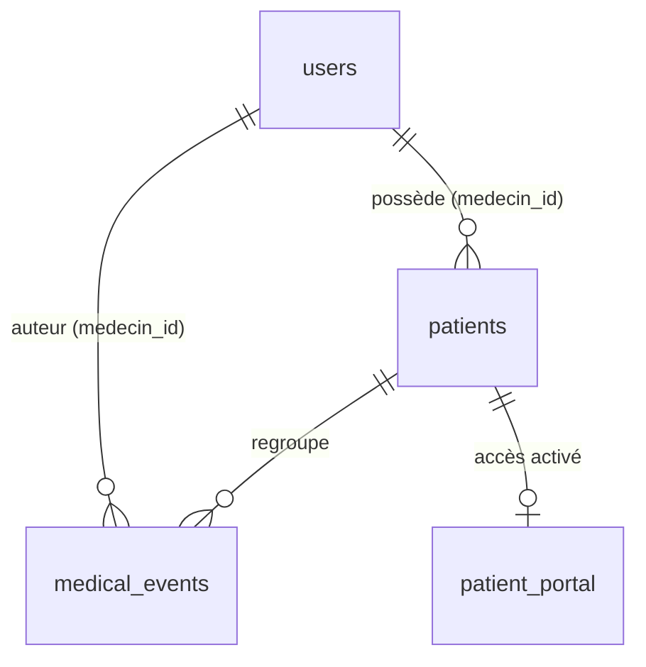

# 06 — ARCHITECTURE

Documentation technique de MediAI : architecture globale, flux de données, authentification, IA, génération documentaire, API et stockage.

---

## 1. Vue d'ensemble

**Principes structurants :**
- **Monolithe Express** volontairement simple (12-factor) : un process, config par variables d'environnement, aucune dépendance propriétaire d'hébergeur.
- **Sous-traitants externes isolés** dans `services/` : changer de fournisseur IA/transcription/email = modifier **un seul fichier**. Fondation de la portabilité HDS ([10_SECURITY.md](10_SECURITY.md)).
- **Frontend sans build** : deux fichiers HTML autonomes. Pas de framework, pas de bundler — déploiement instantané.

---

## 2. Fichiers du backend

| Fichier | Responsabilité |
|---|---|
| `server.js` | Toutes les routes HTTP, middlewares (auth, rate limit, CORS, audit), orchestration métier |
| `db.js` | Connexion Postgres (pool), création du schéma (`initDb`), toutes les requêtes SQL |
| `anonymizer.js` | Dé-identification (regex + termes connus) et ré-identification |
| `prompts.js` | Prompts système/utilisateur de chaque fonction IA |
| `services/ia.js` | `callClaude()` — appel modèle, extraction JSON, comptage tokens |
| `services/transcription.js` | `transcribeAudio()` — appel Whisper |
| `services/email.js` | `sendReportEmail()` — appel Resend |

---

## 3. Flux — génération d'un compte-rendu

C'est le flux central du produit (`POST /api/transcription/analyze`).

**Point clé de confidentialité :** le texte est **anonymisé avant** de quitter le serveur vers Claude, et **ré-identifié après** grâce à la `tokenMap` qui ne quitte jamais le serveur. → [08_AI_SYSTEM.md](08_AI_SYSTEM.md).

---

## 4. Authentification

Deux systèmes JWT distincts, un secret partagé (`JWT_SECRET`), jetons valables 30 j.

- **Médecin** : `requireAuth` vérifie le jeton, charge l'utilisateur, l'attache à `req.medecin`.
- **Patient** : `requirePatientAuth` exige `type:'patient'` + `patientId`, charge la fiche, l'attache à `req.patient`. Un patient ne peut, **par construction**, accéder qu'à sa propre fiche.
- Google : vérification de l'`idToken` côté serveur (`google-auth-library`), création/rattachement du compte.

→ Détails sécurité : [10_SECURITY.md](10_SECURITY.md).

---

## 5. Relation médecin ↔ patient

- Une fiche `patient` est **créée et possédée par un médecin** (`medecin_id`).
- Chaque route patient vérifie l'appartenance (`patient.medecin_id === req.medecin.id`) avant tout accès.
- L'accès portail est activé **par dossier** : le patient reçoit un identifiant/mot de passe propre à *ce* dossier (pas encore un compte unique multi-médecins — chantier futur).

→ [09_PATIENT_SYSTEM.md](09_PATIENT_SYSTEM.md) et [07_DATABASE.md](07_DATABASE.md).

---

## 6. Génération documentaire

Tous les documents (consultation, ordonnance, courrier, analyse, imagerie) sont stockés dans **une seule table polymorphe** `medical_events` (`type` + `data` JSONB). Avantages : chronologie unifiée sans jointures multiples, extensibilité (un nouveau type = une nouvelle valeur de `type`).

- Les documents dérivés (courrier, ordonnance) sont générés à partir d'un événement source et **rattachés au même patient**.
- Le **PDF est généré côté navigateur** (le backend ne stocke pas de fichier) ; l'email transmet une pièce jointe PDF via Resend. Conséquence : pas de stockage binaire aujourd'hui (voir « Stockage » ci-dessous).

---

## 7. API — surface complète

Détail des contrats dans le code (`server.js`). Vue synthétique :

| Domaine | Routes |
|---|---|
| Auth médecin | `POST /api/auth/signup` · `/login` · `/google` · `GET /api/auth/me` · `PUT /api/auth/profile` · `/api/auth/preferences` |
| IA & documents | `POST /api/audio/transcribe` · `/api/transcription/analyze` · `/api/courrier/generate` · `/api/ordonnance/generate` · `/api/ordonnance/check-interactions` · `/api/analyse-labo/generate` · `/api/imagerie/generate` · `/api/symptomes/questions` |
| Patients | `POST /api/patients` · `GET /api/patients` · `GET /api/patients/:id` · `GET /api/patients/:id/resume-intelligent` · `/preparation` · `/search` · `PUT /api/patients/:id/notes` · `POST /api/patients/:id/activate-portal` |
| Portail patient | `POST /api/patient-auth/login` · `GET /api/patient/me` · `/api/patient/timeline` |
| Facturation | `POST /api/create-checkout-session` · `GET /api/verify-session` · `POST /api/stripe/webhook` |
| Divers | `POST /api/send-report-email` · `GET /health` |

Middlewares appliqués : `globalLimiter` (300/15 min) partout sauf `/health` et webhook ; `authLimiter` (20/15 min) sur l'auth ; `aiLimiter` (20/min) + `enforceAiQuota` sur les routes IA ; audit log sur chaque requête.

---

## 8. Stockage

- **PostgreSQL** (Render) : toutes les données structurées. Schéma dans [07_DATABASE.md](07_DATABASE.md).
- **Pas de stockage de fichiers** : audio traité en mémoire (jamais persisté), PDF générés côté client. → simplicité + moins de surface de conformité, mais la timeline « documents » du patient reste incomplète tant qu'aucun stockage objet (S3-compatible) n'est ajouté. Décision ouverte : [14_BACKLOG.md](14_BACKLOG.md).
- **Rate limiting** : store en mémoire (suffisant pour une instance unique ; prévoir Redis en cas de scaling horizontal).

---

## 9. Déploiement

| | Backend | Frontend |
|---|---|---|
| Repo | `mediai` | `mediai-site` |
| Plateforme | Render | Vercel |
| Déclencheur | push sur `main` (auto-deploy ~30 s) | push sur `main` |
| URL | `https://mediai-backend-156u.onrender.com` | Vercel |
| Base | PostgreSQL managé Render | — |

Vérifier qu'un déploiement est à jour : la présence des en-têtes `RateLimit-*` sur une route API confirme le code récent. `GET /health` renvoie la version.

→ Configuration & secrets : [10_SECURITY.md](10_SECURITY.md) et `.env.example`.
