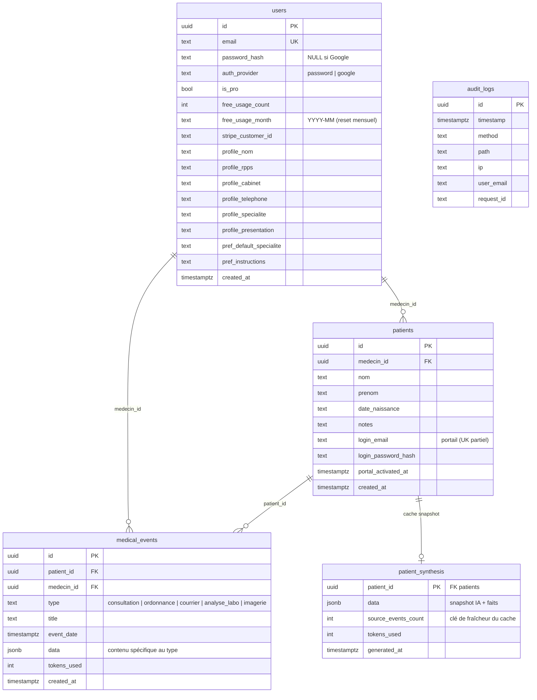

# 07 — DATABASE

Schéma PostgreSQL de MediAI. Source d'implémentation : `db.js` (`initDb()` crée/migre les tables au démarrage). Toutes les migrations sont **idempotentes** (`CREATE TABLE IF NOT EXISTS`, `ALTER TABLE ... ADD COLUMN IF NOT EXISTS`) — sûres à chaque redéploiement.

---

## Schéma relationnel



---

## Tables

### `users` — comptes médecins
Identité, abonnement et préférences du médecin.
- **Auth** : `password_hash` peut être `NULL` (comptes Google) ; `auth_provider` distingue `password` / `google`.
- **Quota gratuit** : `free_usage_count` + `free_usage_month`. La remise à zéro est **paresseuse** : si `free_usage_month` ≠ mois courant, le compteur est considéré à 0 (voir `effectiveFreeUsage` dans `server.js`). Aucune tâche planifiée nécessaire.
- **Abonnement** : `is_pro` + `stripe_customer_id` (permet de retrouver l'utilisateur depuis un événement webhook).
- **Profil** : `profile_*` (dont `specialite` / `presentation`, fondation d'une future recherche de praticien).

### `patients` — fiches patients
Créée et **possédée par un médecin** (`medecin_id`, `ON DELETE CASCADE`).
- **Portail** : `login_email` (index unique partiel `WHERE login_email IS NOT NULL`), `login_password_hash`, `portal_activated_at`. Accès activé dossier par dossier. → [09_PATIENT_SYSTEM.md](09_PATIENT_SYSTEM.md).

### `medical_events` — chronologie polymorphe ⭐
Table centrale. **Un type d'événement = une valeur de `type`**, le contenu spécifique vit dans `data` (JSONB).
- Types actuels : `consultation`, `ordonnance`, `courrier`, `analyse_labo`, `imagerie`.
- Index : `idx_medical_events_patient (patient_id, event_date DESC)` pour la timeline.
- C'est cette structure qui permet la chronologie unifiée et la timeline intelligente sans multiplier les tables.

### `patient_synthesis` — cache du Patient Snapshot (Phase 5)
Une ligne par patient (`patient_id` en PK, `ON DELETE CASCADE`). Mémorise la synthèse de fond du dossier (JSONB) et le nombre d'événements au moment de la génération (`source_events_count`). Le snapshot est régénéré quand ce compteur ne correspond plus au nombre réel d'événements. Upsert via `savePatientSynthesis`. → [08_AI_SYSTEM.md](08_AI_SYSTEM.md).

### `audit_logs` — journalisation
Une ligne par requête HTTP (méthode, chemin, IP, email éventuel, `request_id`). L'écriture n'échoue **jamais** une requête (erreurs seulement journalisées). Fondation de traçabilité pour la conformité HDS.

---

### Tables du Cockpit (Sprint 6)

Ajoutées pour transformer la Home en cockpit. Créées par `initDb()` (idempotent). Aucune donnée médicale n'y est inventée : RDV/tâches/messages sont **saisis**, le reste est **dérivé**.

- **`appointments`** — module Rendez-vous. `medecin_id`, `patient_id` (NULL autorisé → `patient_label` libre), `start_at`/`end_at`, `motif`, `mode` (`cabinet`/`visite`/`teleconsultation`), `status` (`planifie`/`confirme`/`en_salle`/`termine`/`annule`/`absent`). Index `(medecin_id, start_at)`.
- **`tasks`** — moteur de tâches. `type`, `priority`, `status`, `due_date`, `source` (`manuel`/`ia`/`systeme`), `source_ref`. **Index unique partiel** `(medecin_id, source_ref) WHERE source_ref IS NOT NULL` : anti-doublon des tâches système matérialisées depuis les signaux.
- **`workspace_layouts`** — layouts personnalisables du cockpit. `name`, `mode`, `layout` JSONB (ordre/taille/visibilité des widgets), `is_default`. (Persistance serveur consommée au Lot 3.)
- **`message_threads`** / **`messages`** — messagerie sécurisée (fondations). Contenu 100 % rédigé par les utilisateurs. `sender_type` (`medecin`/`patient`), horodatages de lecture séparés.
- **`cockpit_briefings`** — cache du récit IA du cockpit (1 ligne/médecin), régénéré quand la **signature des faits du jour** (`facts_signature`) change. Non décompté du quota.

### Tables du Dossier intelligent (Sprint 7)

- **`patient_key_facts`** — « À retenir » structuré et éditable : `category` (`allergie`/`antecedent`/`maladie_chronique`/`vaccin`/`note`), `label`, `detail`, `severity`, `position`. Complété côté app par du dérivé (traitements actifs = dernière ordonnance, dernière hospitalisation = dernier événement `hospitalisation`).
- **`patient_evolution`** — cache du récit de tendances (IA descriptive), régénéré au changement d'événements (`source_events_count`).

### Ordonnance — module (Sprint 8, sans nouvelle table)

L'ordonnance reste un `medical_event` type `ordonnance` dont le `data` JSONB est **enrichi** : `status` (`brouillon`/`active`/`archivee`/`arretee`), `prescriptions[]` (medicament, posologie, durée, `duree_jours`, `renouvellements`, voie), `date_debut`/`date_fin`, `signed_at`/`signed_by`, `renewed_from`/`renewed_at`, `version`, `history[]` (append-only). Le **renouvellement** crée un nouvel événement lié (`renewed_from`) et archive l'ancien. Rétrocompatible : une ordonnance sans `status` est traitée comme `active`.

**Types d'événements** (`medical_events.type`) élargis au Sprint 7 : + `hospitalisation`, `urgences`, `vaccination`, `teleconsultation`, `document`, `analyse_ia`.

## Conventions

- **Clés primaires** : `UUID` générés côté application (`crypto.randomUUID()`), jamais de séquences auto-incrémentées.
- **Horodatage** : `TIMESTAMPTZ DEFAULT now()`.
- **Cascade** : la suppression d'un médecin supprime ses patients et événements ; la suppression d'un patient supprime ses événements.
- **SSL** : activé automatiquement quand `DATABASE_URL` a un hôte à domaine complet (base externe), désactivé pour un hôte interne Render (voir `detectNeedsSSL`).

---

## Migrations & évolution

Il n'y a **pas d'outil de migration dédié** : `initDb()` fait foi et applique des `ALTER` idempotents. Pour ajouter une colonne : ajouter un `ALTER TABLE ... ADD COLUMN IF NOT EXISTS` dans `initDb()`.

> À mesure que le schéma grandit, envisager un vrai gestionnaire de migrations versionnées (ex. `node-pg-migrate`). → [14_BACKLOG.md](14_BACKLOG.md).

---

## Table retirée — `compte_rendus` (legacy)

L'ancienne table `compte_rendus` (comptes-rendus non rattachés à un patient) a été **abandonnée** au profit de `medical_events`. Son code (endpoints `/api/historique`, `/api/compterendu/:id` et fonctions DB) a été supprimé lors de la consolidation Phase 0. → [CHANGELOG.md](CHANGELOG.md).

**Nettoyage des bases existantes** — un script sûr est fourni : il vérifie que la table est **vide** avant de la supprimer (sinon il abandonne). À exécuter une fois contre la base de production :
```bash
DATABASE_URL='postgres://...' node scripts/drop-compte-rendus.js
```
Ce `DROP` n'est **pas** exécuté au démarrage du serveur (une suppression destructive ne doit jamais tourner à chaque boot).
