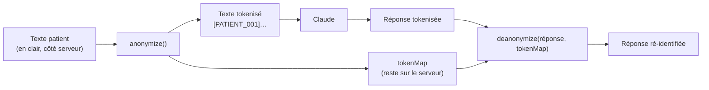

# 08 — AI SYSTEM

Comment fonctionne l'intelligence artificielle dans MediAI. Sources : `prompts.js`, `anonymizer.js`, `services/ia.js`, `services/transcription.js`.

---

## Principe déontologique

> **L'IA assiste. Elle ne décide jamais. Toutes ses sorties sont modifiables.**

MediAI n'est pas un outil de décision clinique. L'IA **structure** ce que le médecin a dit, **rappelle** des points de vigilance, **extrait** des informations. Elle n'émet pas de diagnostic, ne prescrit pas, ne conclut pas.

---

## Modèles utilisés

| Fonction | Fournisseur | Modèle | Fichier |
|---|---|---|---|
| Génération de texte (comptes-rendus, courriers, structuration…) | Anthropic Claude | `claude-sonnet-4-6` (surchargé par `CLAUDE_MODEL`) | `services/ia.js` |
| Transcription audio | OpenAI Whisper | `whisper-1` | `services/transcription.js` |

`callClaude({ system, user, maxTokens })` centralise l'appel : en-têtes, modèle, extraction du **premier bloc JSON** de la réponse, comptage des tokens. Tout passe par là — changer de modèle/fournisseur ne touche qu'`ia.js`.

---

## Chaîne d'anonymisation (confidentialité)

**`anonymizer.js` — deux étapes :**
1. **Regex best-effort** : NIR, RPPS, dates, dates de naissance, noms précédés d'une civilité/formule, téléphones, emails, adresses, codes postaux.
2. **Termes connus déterministes** : le nom/prénom **exact** du patient concerné (connu via `patientId`) et le nom du médecin sont retirés de façon certaine, *avant* les regex. C'est la seule partie qui offre une vraie garantie (on ne « devine » pas, on connaît la valeur).

Un **filet de sécurité** (`stats.residualKnownTerm`) vérifie qu'aucun terme connu ne subsiste en clair après anonymisation.

> ⚠️ **Limite honnête** : ni regex ni NER n'offrent une **garantie stricte** à 100 % (noms de tiers cités sans civilité, fautes de frappe…). La vraie garantie de confidentialité relève du **juridique + hébergement** (DPA/Zero Data Retention côté fournisseur + hébergement HDS), pas seulement du code. → [10_SECURITY.md](10_SECURITY.md).

> ⚠️ **Point chaud : la transcription.** L'audio brut d'une consultation (voix + noms prononcés) part chez Whisper **non anonymisé** — c'est le maillon faible. Le remplacement par une transcription auto-hébergée est prioritaire pour la conformité (`services/transcription.js` est isolé exactement pour ça).

---

## Fonctions IA (prompts)

Chaque prompt hérite de `BASE_SYSTEM` (sauf vigilance médicamenteuse) qui pose les règles absolues : ne rien inventer, conserver les tokens, terminologie française officielle, pas de diagnostic définitif, `[À VÉRIFIER]` sur toute incohérence.

| Prompt (`prompts.js`) | Endpoint | Rôle |
|---|---|---|
| `PROMPTS.generaliste` | `/api/transcription/analyze` | Compte-rendu SOAP (médecine générale) |
| `PROMPTS.kinesitherapeute` | idem (spécialité) | Compte-rendu kiné |
| `PROMPTS.resume_rapide` | idem (spécialité) | Résumé court |
| `PROMPTS.courrier` | `/api/courrier/generate` | Courrier de correspondance depuis une consultation |
| `DOSSIER_SUMMARY_PROMPT` | `/api/patients/:id/resume-intelligent` | Synthèse narrative du dossier |
| `PRE_CONSULT_PROMPT` | `/api/patients/:id/preparation` | Briefing avant consultation |
| `SEARCH_PROMPT` | `/api/patients/:id/search` | Recherche sémantique dans le dossier |
| `SYMPTOM_QUESTIONS_PROMPT` | `/api/symptomes/questions` | Questions d'interrogatoire (exhaustivité, pas orientation) |
| `INTERACTION_CHECK_PROMPT` | `/api/ordonnance/check-interactions` | Vigilance médicamenteuse |
| `LAB_STRUCTURING_PROMPT` | `/api/analyse-labo/generate` | Structuration d'un CR de laboratoire |
| `IMAGING_STRUCTURING_PROMPT` | `/api/imagerie/generate` | Structuration d'un CR d'imagerie |
| `PATIENT_SNAPSHOT_PROMPT` | `/api/patients/:id/snapshot` | Couche IA du Patient Snapshot (Phase 5) — voir ci-dessous |
| `TIMELINE_NARRATIVE_PROMPT` | `/api/patients/:id/timeline-narrative` | Récit du dossier par périodes (descriptif/temporel) — cache `timeline_narratives`, régénéré au changement d'événements |
| `COCKPIT_BRIEFING_PROMPT` | `/api/cockpit/briefing` | **Sprint 6** — récit du matin + suggestions d'organisation. Ne reçoit QUE des **faits agrégés anonymisés** (compteurs + tokens `[PATIENT_n]`, jamais le contenu clinique brut). Non-décisionnel : « suggestions » (« vous pourriez… »), jamais un diagnostic. Cache `cockpit_briefings` (clé = signature des faits du jour), non décompté du quota. |

### Garde-fous notables
- **Interactions médicamenteuses** : ne signale que des interactions **largement documentées**, toujours formulées comme « à vérifier via source officielle » (jamais « contre-indiqué »), et rappelle systématiquement que ce n'est pas un avis pharmaceutique. En cas de doute → ne rien signaler plutôt qu'une fausse alerte.
- **Questions d'interrogatoire** : rappelle les questions standard associées à un symptôme, **sans jamais suggérer de piste diagnostique ni de conduite à tenir**.
- **Labo / imagerie** : **extraction administrative uniquement** — structurer un compte-rendu déjà rédigé par le biologiste/radiologue, jamais l'interpréter, jamais analyser une image.

---

## Patient Snapshot — couche d'intelligence patient (Phase 5)

Synthèse de fond du dossier, affichée en tête de la fiche patient. **Conçue hybride pour ne jamais halluciner sur le médical sensible :**

| Partie | Source | Contenu |
|---|---|---|
| **Déterministe** (jamais l'IA) | code, à partir des vrais événements | `traitements_en_cours` (dernière ordonnance), `derniere_consultation`, compteurs |
| **Intelligente** (IA) | `PATIENT_SNAPSHOT_PROMPT` sur la chronologie anonymisée | `synthese_narrative`, `briefing_consultation` (récit du Cockpit, Sprint 2), `problemes_actifs`, `antecedents_notables`, `points_de_vigilance`, `suivi_a_prevoir` |

Le prompt **interdit explicitement** de lister des médicaments (gérés côté déterministe) et de poser un diagnostic. La `synthese_narrative` est la pièce maîtresse (3–5 phrases naturelles, ton « résumé de confrère »). Les points de vigilance portent une **sévérité hiérarchisée** — `important` (rare, critique et explicite), `attention`, `info` — pour que le médecin saisisse le niveau d'attention en une seconde (couleurs rouge/orange/bleu côté UI).

**Cache & coût** : le résultat est mémorisé dans la table `patient_synthesis` et **régénéré uniquement quand le nombre d'événements du patient change** (`isSnapshotStale`). L'endpoint est **volontairement non décompté du quota gratuit** (fonction « toujours active » déclenchée par l'ouverture d'un dossier) mais protégé par `aiLimiter`. Cost/latence maîtrisés par le cache. → `buildSnapshotFacts` / `generateSnapshotIntelligence` dans `server.js`, tests dans `test/snapshot.test.js`.

## Instructions personnalisées

Un médecin peut définir des `preferences.instructions` (max 1000 caractères) injectées dans le prompt système du compte-rendu, **sans jamais contredire** les règles de base.

---

## Quota & coût

- Toute fonction IA passe par `enforceAiQuota` (bloque à `FREE_LIMIT = 3` actions/mois pour un compte gratuit) puis `consumeAiCredit` **après** un appel réellement effectué.
- Attention UX : transcription + analyse = **2 crédits** pour une seule consultation. À surveiller (relever le quota ou exclure les endpoints légers). → [14_BACKLOG.md](14_BACKLOG.md).
- Le coût en tokens est estimé et renvoyé dans la méta de réponse.

---

## Règles pour le développement IA

1. **Anonymiser avant, ré-identifier après** — toute donnée patient envoyée à un modèle passe par `anonymize()` / `deanonymize()`.
2. Passer par `callClaude()` — ne jamais appeler l'API Anthropic en direct depuis `server.js`.
3. Tout nouveau prompt hérite des règles de `BASE_SYSTEM` et reste **non décisionnel**.
4. Toute sortie IA affichée à l'utilisateur doit être **éditable** et signalée comme suggestion/déduction.
