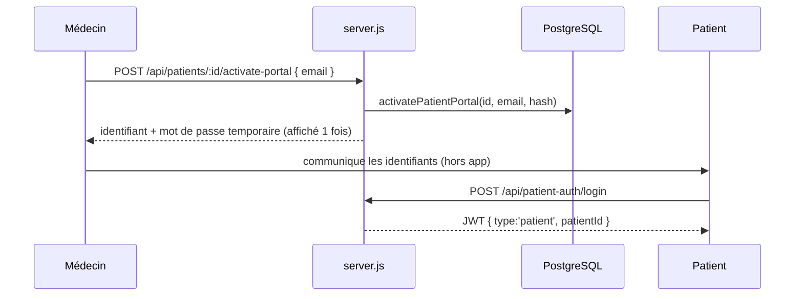

# 09 — PATIENT SYSTEM

Le portail patient : son rôle, son cloisonnement de sécurité, et son état. Frontend : `mediai-site/patient.html`. Backend : routes `/api/patient-auth/*` et `/api/patient/*` dans `server.js`.

---

## Rôle

Le patient consulte **son propre dossier** de façon ponctuelle : documents, comptes-rendus, ordonnances, chronologie, coordonnées de son médecin. **Il ne peut jamais modifier son dossier** — lecture seule.

C'est le second des « deux univers » MediAI : interface **rassurante, simple, mobile-first**, à l'opposé de la densité de l'app médecin. → [01_VISION.md](01_VISION.md), [05_UX_PRINCIPLES.md](05_UX_PRINCIPLES.md).

---

## Activation de l'accès (par le médecin)

- L'accès est activé **dossier par dossier**. Le médecin reçoit un mot de passe temporaire **affiché une seule fois**, qu'il transmet lui-même (pas d'email automatique aujourd'hui).
- `login_email` a un index unique partiel : un même email ne peut pas servir deux dossiers.

---

## Cloisonnement de sécurité 🔒

Le système d'auth patient est **totalement distinct** de celui du médecin :

- Le jeton patient porte `type:'patient'` + `patientId` — **jamais** un email de médecin.
- `requirePatientAuth` **rejette** tout jeton sans `type:'patient'`, et charge la fiche par `patientId`.
- Un patient ne peut, **par construction**, accéder qu'à **sa propre fiche** : les routes patient lisent uniquement `req.patient.id`, jamais un id fourni par le client.
- Les routes patient n'exposent que des données de lecture (profil, timeline).

→ Modèle de menace complet : [10_SECURITY.md](10_SECURITY.md).

---

## Routes du portail

| Route | Auth | Rôle |
|---|---|---|
| `POST /api/patient-auth/login` | publique | Connexion patient → JWT patient |
| `GET /api/patient/me` | patient | Profil du patient + coordonnées de son médecin |
| `GET /api/patient/timeline` | patient | Chronologie de **ses** événements |

---

## État & limites

- ✅ Fonctionnel : connexion, accueil, traitements en cours, documents récents, recherche, chronologie, profil.
- ⚠️ **Différenciation visuelle non réalisée** : `patient.html` réutilise aujourd'hui la **même palette** que l'app médecin. La VISION impose que les deux univers ne soient jamais identiques → donner au portail une identité propre (chaleureuse, épurée, « suivi de santé ») est la **prochaine priorité** du portail. → [11_ROADMAP.md](11_ROADMAP.md), [14_BACKLOG.md](14_BACKLOG.md).
- ⚠️ **Timeline documents incomplète** : les PDF étant générés côté client et non stockés, le patient ne peut pas (encore) télécharger ses documents. Décision de stockage ouverte. → [06_ARCHITECTURE.md](06_ARCHITECTURE.md) §8.
- 🔮 **Compte patient unique multi-médecins** : aujourd'hui un accès = un dossier chez un médecin. Un compte patient valable chez plusieurs praticiens est un chantier futur.
