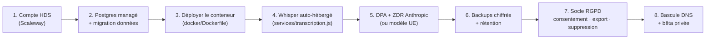

# 10 — SECURITY, RGPD & HDS

Sécurité applicative, conformité RGPD/HDS et **préparation de la migration**. Ce fichier doit permettre de mener la migration HDS sans redécouvrir le projet.

---

## Règle d'or (non négociable)

> **Tant que l'infrastructure n'est pas hébergée HDS, AUCUNE vraie donnée patient.** Données **synthétiques uniquement**.

L'infra actuelle (Render US + Claude/Whisper US) **n'est pas certifiée HDS**. C'est ce qui permet, légalement, de repousser la migration sans bloquer le développement — à condition stricte de ne manipuler que des données fictives.

---

## 1. Sécurité applicative en place

| Mesure | Détail |
|---|---|
| **JWT fail-closed** | En production, le serveur **refuse de démarrer** si `JWT_SECRET` est absent (plus de secret par défaut forgeable). |
| **Hachage** | Mots de passe médecins et patients hachés avec `bcrypt` (10 rounds). |
| **Rate limiting** | Global 300/15 min · Auth 20/15 min (anti brute-force) · IA 20/min. `trust proxy` activé pour l'IP réelle derrière Render. |
| **Cloisonnement médecin/patient** | Deux systèmes JWT distincts ; vérification d'appartenance (`medecin_id`) sur chaque route ; un patient n'accède qu'à sa fiche. |
| **CORS restreint** | Origines autorisées via `ALLOWED_ORIGINS` (liste blanche : domaines Vercel + localhost dev). Plus de `*`. |
| **Anonymisation** | Dé-identification avant tout envoi IA (défense en profondeur). → [08_AI_SYSTEM.md](08_AI_SYSTEM.md). |
| **Audit logs** | Chaque requête journalisée en base (méthode, chemin, IP, email, request_id). |
| **Webhook Stripe signé** | Vérification de signature (`STRIPE_WEBHOOK_SECRET`) sur corps brut. |

### Journalisation — hygiène
- Ne **jamais** logger de secret, de mot de passe, ni de contenu patient.
- Les logs de démarrage n'affichent **pas** de fragment de clé API (seulement présent/absent).
- Les erreurs sont journalisées avec un `requestId`, sans payload sensible.

---

## 2. Configuration & secrets

Toute la surface de configuration est documentée dans **`.env.example`**. Le `.env` réel n'est **jamais** committé (présent dans `.gitignore`).

| Variable | Obligatoire | Rôle |
|---|---|---|
| `DATABASE_URL` | ✅ | Connexion PostgreSQL |
| `JWT_SECRET` | ✅ (prod) | Signature des jetons — serveur bloqué sans, en prod |
| `ANTHROPIC_API_KEY` | ✅ | Claude |
| `CLAUDE_MODEL` | — | Surcharge du modèle (défaut `claude-sonnet-4-6`) |
| `OPENAI_API_KEY` | — | Whisper (transcription) |
| `STRIPE_SECRET_KEY` / `STRIPE_PRICE_ID` / `STRIPE_WEBHOOK_SECRET` | — | Abonnement + webhook |
| `RESEND_API_KEY` | — | Email transactionnel |
| `EMAIL_FROM` | — | Adresse d'expéditeur (défaut : adresse de test Resend ; **à remplacer par un domaine vérifié** en prod) |
| `GOOGLE_CLIENT_ID` | — | Connexion Google |
| `ALLOWED_ORIGINS` | — | Liste blanche CORS (séparée par des virgules) |
| `NODE_ENV` | ✅ (prod) | `production` active les garde-fous |
| `PORT` | — | Fourni par la plateforme |

**Rotation** : en cas de fuite, régénérer la clé concernée côté fournisseur puis mettre à jour la variable sur l'hébergeur (aucun secret n'est en dur dans le code).

---

## 3. Transparence (pas de fausse affirmation)

> Aucune affirmation de conformité ne doit être mensongère.

- `GET /health` **ne prétend plus** `hds_compliant: true`. Il expose l'état réel : `hds_compliant: false` et `data_policy: "synthetic-only"` tant que l'infra n'est pas migrée.
- Toute mention « conforme / sécurisé / chiffré » dans l'UI ou la doc doit correspondre à un fait vérifiable.

---

## 4. Conformité — feuille de route HDS/RGPD (4 étapes)

Validée le 2026-07-14 (startup pré-lancement, pas encore de vrais patients). Approche pragmatique, anti-sur-ingénierie.

- **Étape 1 — Portabilité & hygiène.** ✅ FAIT : sous-traitants isolés dans `services/`, `.env.example`, `Dockerfile` (dans `docker/`), `.dockerignore`. `server.js` n'appelle plus aucune API externe en direct.
- **Étape 2 — Avant bêta privée :** migration hébergement HDS + transcription auto-hébergée + backups chiffrés + socle documentaire RGPD + consentement + export/suppression de dossier.
- **Étape 3 — Avant commercialisation :** DPIA, registre des traitements, DPO, pentest, plan d'incident.
- **Étape 4 — Continu :** maintien de la conformité.

---

## 5. Préparation de la migration HDS

### Ce qui bloque aujourd'hui
1. **Hébergement non HDS** : Render (US) → hébergeur certifié HDS France/UE.
2. **Transcription US non anonymisée** : l'audio brut part chez OpenAI Whisper → **le maillon faible n°1**.
3. **API Claude non certifiée HDS** : nécessite a minima un DPA + **Zero Data Retention** côté Anthropic, et idéalement un routage UE pour les données identifiables.
4. **Pas de socle RGPD** : consentement, registre, export/suppression, politique de conservation.

### Atouts déjà en place (la migration sera simple)
- Architecture **12-factor** : config par env, aucune dépendance propriétaire d'hébergeur.
- **PostgreSQL standard**, **pas de stockage de fichiers** propriétaire.
- Sous-traitants **isolés** (`services/`) : remplacer Whisper/Claude/Resend = 1 fichier chacun.
- Conteneurisation prête (`docker/Dockerfile`).

### Hébergeur recommandé
**Scaleway** (meilleure DX, Postgres managé, S3, Serverless Containers ≈ modèle Render → migration la plus directe). Plan B : **OVHcloud**. **Outscale** uniquement si SecNumCloud requis (surdimensionné à ce stade).

### Étapes de migration (haut niveau)

### Modifications de code nécessaires (limitées)
- `services/transcription.js` : pointer vers l'instance Whisper auto-hébergée.
- `services/ia.js` : éventuel routage/endpoint UE + en-têtes ZDR.
- `services/email.js` : fournisseur email UE + `EMAIL_FROM` sur domaine vérifié.
- Ajouter : endpoints RGPD (export/suppression d'un dossier), gestion du consentement.
- `db.js` : politique de rétention / purge.

### Risques
- **Qualité de la transcription auto-hébergée** vs Whisper cloud (à valider).
- **Continuité de service** pendant la bascule DB (fenêtre de maintenance).
- **Coût/latence** d'un modèle UE éventuel.
- **Complétude de l'anonymisation** : reste best-effort côté code ; la garantie vient du cadre juridique.

---

## 6. Modèle de menace (résumé)

| Menace | Mitigation actuelle |
|---|---|
| Jeton forgé | `JWT_SECRET` fail-closed, secret fort obligatoire en prod |
| Brute-force login | `authLimiter` (20/15 min) + bcrypt |
| Accès au dossier d'un autre patient | Jeton `type:'patient'` + lecture par `patientId` du jeton uniquement |
| Accès médecin croisé | Vérification `medecin_id` sur chaque route |
| Fuite de données vers l'IA | Anonymisation + (à venir) ZDR/HDS |
| Webhook falsifié | Signature Stripe vérifiée |
| CSRF/CORS | Liste blanche d'origines |
| Abus/coût IA | Quota + `aiLimiter` |

**Rappel** : la sécurité applicative est bonne pour le stade, mais la **conformité HDS** (hébergement + juridique) reste le vrai prérequis avant tout vrai patient.
