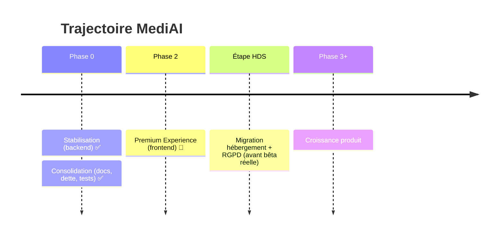

# 11 — ROADMAP

Trajectoire produit de MediAI. Pour l'état détaillé du présent, voir [03_PROJECT_STATE.md](03_PROJECT_STATE.md) ; pour la dette et les idées non planifiées, [14_BACKLOG.md](14_BACKLOG.md).

---

## Vue par phases

---

## ✅ Phase 0 — Fondations (terminée)

- **Stabilisation backend** : modèle Claude, sécurité (JWT, rate limit, CORS), quota IA, webhook Stripe, anonymisation renforcée, portabilité.
- **Consolidation** (2026-07) : documentation unique, nettoyage de la dette, transparence, base de tests.

## 🔄 Phase 2 — Premium Experience (en cours)

Objectif : *le logiciel médical le plus agréable à utiliser en France.* Polish incrémental du frontend, sans casser l'existant.

Livré : design foundation, dashboard « Aujourd'hui », fiche patient moderne, refonte sidebar, timeline interactive, pivot palette bleue.

**Reste à faire (ordre validé) :**
1. **Expérience patient différenciée** — identité visuelle propre pour `patient.html`.
2. **⌘K / recherche universelle** raffinée (Spotlight).
3. **Centre de notifications**.
4. **Micro-interactions & finitions** globales.

## 🔒 Étape HDS — Conformité (avant toute bêta avec de vrais patients)

Bloqueur absolu. Migration hébergement HDS + transcription auto-hébergée + socle RGPD (consentement, export, suppression). → [10_SECURITY.md](10_SECURITY.md).

## 🔮 Phase 3+ — Croissance (non planifié en détail)

Pistes issues de la vision « OS médical » : assistant IA conversationnel, timeline intelligente enrichie, multi-praticiens & collaboration, signature électronique, dictée vocale temps réel, applications iPhone/iPad, notifications intelligentes, recherche de praticien (fondations déjà dans le profil).

---

## Règle de priorisation

Une fonctionnalité entre dans la roadmap **seulement si** elle fait gagner du temps de façon concrète (→ [01_VISION.md](01_VISION.md)). La qualité prime sur la vitesse : on professionnalise avant d'ajouter.
