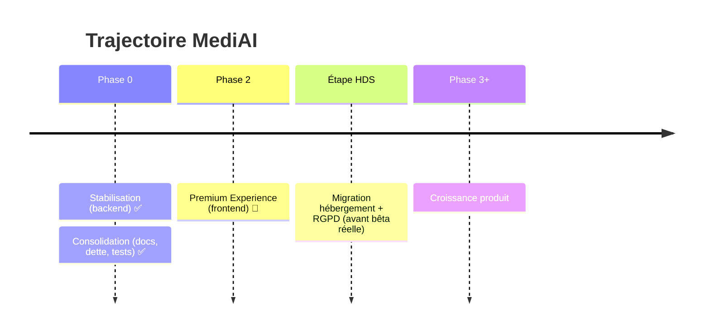

# 11 — ROADMAP

Trajectoire produit de MediAI. Pour l'état détaillé du présent, voir [03_PROJECT_STATE.md](03_PROJECT_STATE.md) ; pour la dette et les idées non planifiées, [14_BACKLOG.md](14_BACKLOG.md).

---

## Vue par phases

---

## ✅ Phase 0 — Fondations (terminée)

- **Stabilisation backend** : modèle Claude, sécurité (JWT, rate limit, CORS), quota IA, webhook Stripe, anonymisation renforcée, portabilité.
- **Consolidation** (2026-07) : documentation unique, nettoyage de la dette, transparence, base de tests.

## 🔄 Phase 2 — Premium Experience (en cours)

Objectif : *le logiciel médical le plus agréable à utiliser en France.* Polish incrémental du frontend, sans casser l'existant.

Livré : design foundation, dashboard « Aujourd'hui », fiche patient moderne, refonte sidebar, timeline interactive, pivot palette bleue.

**Reste à faire (ordre validé) :**
1. **Expérience patient différenciée** — identité visuelle propre pour `patient.html`.
2. **⌘K / recherche universelle** raffinée (Spotlight).
3. **Centre de notifications**.
4. **Micro-interactions & finitions** globales.

## 🚀 Phase 5 — MediAI OS : couche d'intelligence patient (démarrée)

Le saut de qualité qui distingue MediAI : passer de « structurer une consultation » à « comprendre un patient ». Chaque sprint = valeur visible.

1. ✅ **Patient Snapshot** — synthèse de fond vivante en tête de fiche (fondation des piliers suivants).
2. 🔄 **Consultation Cockpit** — le dossier vu comme un briefing préparé (2.1 livré : hero, briefing IA, rappels, évolution, temps gagné ; à venir : timeline premium, recherche clinique, lecture 30 s, constantes). Vise à devenir la fonctionnalité signature de MediAI.
3. **Ambient AI Consultation** — dictée vocale → compte-rendu SOAP + ordonnances + courriers + tâches de suivi + timeline mis à jour en un clic (concurrent sérieux des solutions d'IA médicale avancées).
4. **Signaux & alertes** — détection proactive (suivis en retard, interactions sur tout le dossier, tendances).
5. **Différenciation patient & finitions.**

## 🧭 Sprint 6 — MediAI Cockpit (la Home devient le cerveau) — EN COURS

La Home cesse d'être une page d'accueil : elle devient un **cockpit** où l'information vient au médecin. Construit sur de **vrais systèmes** (RDV, tâches, moteur d'expiration d'ordonnance, workspace, messagerie), jamais sur du faux.

1. ✅ **Lot 1 — Fondations backend** : module `cockpit.js` (déterministe, testé), tables `appointments`/`tasks`/`workspace_layouts`/messagerie/`cockpit_briefings`, API cockpit + CRUD, prompt de briefing IA anonymisé.
2. ✅ **Lot 2 — Cockpit frontend** : barre de briefing, modes (Cockpit/Consultation/Cabinet/Visite/Urgences), widgets actionnables (agenda, priorités, tâches, résultats, renouvellements, recommandations IA, messages, activité), personnalisation `localStorage`.
3. ⏭️ **Lot 3 — Workspace** : drag & drop, redimensionnement, layouts serveur multiples.
4. ⏭️ **Lot 4 — Messagerie** : inbox complète + côté portail patient ; durées d'ordonnance structurées à la saisie.

## 🔒 Étape HDS — Conformité (avant toute bêta avec de vrais patients)

Bloqueur absolu. Migration hébergement HDS + transcription auto-hébergée + socle RGPD (consentement, export, suppression). → [10_SECURITY.md](10_SECURITY.md).

## 🔮 Phase 3+ — Croissance (non planifié en détail)

Pistes issues de la vision « OS médical » : assistant IA conversationnel, timeline intelligente enrichie, multi-praticiens & collaboration, signature électronique, dictée vocale temps réel, applications iPhone/iPad, notifications intelligentes, recherche de praticien (fondations déjà dans le profil).

---

## Règle de priorisation

Une fonctionnalité entre dans la roadmap **seulement si** elle fait gagner du temps de façon concrète (→ [01_VISION.md](01_VISION.md)). La qualité prime sur la vitesse : on professionnalise avant d'ajouter.
